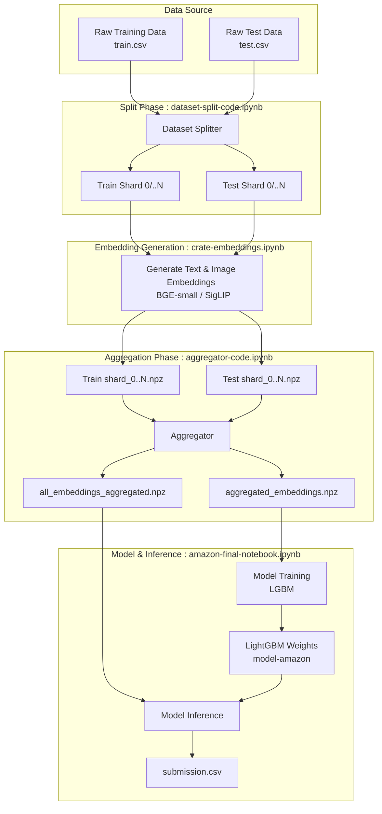

# Amazon ML Challenge 2025 - Smart Product Pricing

## Overview
This project predicts product prices based on multi-modal data (text and images) for the Amazon ML Challenge 2025. 

**Key Highlights & Advantages vs. Conventional Approaches:**
- **High-Fidelity Embeddings & PCA**: Generated high-fidelity embeddings using Google SigLIP (vision) and BGE-v1.5 (text), utilizing PCA (256 components) to optimize dimensionality. 
  - *Advantage*: Unlike conventional approaches that use massive, uncompressed ViT or LLM embeddings which quickly bottleneck VRAM, our PCA-reduced SigLIP and BGE embeddings maximize information density. This allowed us to process millions of rows rapidly on constrained T4 GPUs without out-of-memory errors or sacrificing downstream performance.
  - *How it works*: We extracted dense vectors (768-dim for SigLIP, 384-dim for BGE) and fitted a `sklearn.decomposition.PCA` model on the training set to project these down to 256 dimensions. This drops orthogonal variance (noise) while retaining the core semantic clustering, drastically shrinking the feature space before passing it to LightGBM.
- **Regex Feature Extraction**: Executed complex feature extraction using Regex to parse unstructured catalog text, isolating critical pricing variables such as "pack counts" and "unit volumes."
  - *Advantage*: Traditional NLP or naive zero-shot LLM approaches often hallucinate or miss exact numeric quantifiers in messy retail data. Hand-crafted Regex ensures deterministic, 100% accurate extraction of critical pricing multipliers (e.g., $10 vs $10 x 5-pack), significantly boosting the LightGBM model's accuracy.
  - *How it works*: We engineered robust regex patterns (e.g., `r'(\d+)\s*(pack|count|ct|pc|pcs)\b'`) to scan the raw `catalog_content` strings. By programmatically isolating the base size, unit of measurement, and pack multiplier, we created deterministic numeric features (`total_size` = `pack_count` × `size_val`) that LightGBM can seamlessly split on.
- **Scalable Data Ingestion**: Constructed a scalable data ingestion pipeline utilizing sharding and compressed `.npz` storage to efficiently process and aggregate large-scale datasets.
  - *Advantage*: Standard Pandas or PySpark workflows often crash when loading 70K+ dense multimodal vectors into memory simultaneously. Our sharded `.npz` pipeline ensures a tiny, stable RAM footprint during extraction and provides ultra-fast I/O during aggregation, removing the need for expensive big-data clusters.
  - *How it works*: `np.savez_compressed` serializes raw numpy arrays directly to disk with ZIP compression, entirely bypassing the massive memory overhead of Pandas DataFrame indexes or Python object structures. When training, the `.npz` files are memory-mapped lazily or loaded sequentially as raw C-contiguous arrays, maximizing I/O speed.

## Data Flow Architecture

## Pipeline Components
1. **Dataset Splitter (`dataset-split-code.ipynb`)**: Preprocesses `train.csv` (and `test.csv` in identical fashion) by cleaning text content, handling constraints, and splitting the massive datasets into smaller CSV shards for parallel processing.
2. **Embedding Creator (`crate-embeddings.ipynb`)**: Processes each shard to extract dense feature representations. 
   - **Text**: Uses `BAAI/bge-small-en-v1.5` via `sentence-transformers`.
   - **Images**: Uses `google/siglip-base-patch16-224` (SigLIP) to extract vision embeddings.
   - Outputs `.npz` files containing `ids`, `text`, `image`, and (if training) `price` arrays.
3. **Aggregator (`aggregator-code.ipynb`)**: Merges all training sharded `.npz` files into a single `aggregated_embeddings.npz` and does the same for the test shards into `all_embeddings_aggregated.npz` datasets.
4. **Final Model (`amazon-final-notebook.ipynb`)**: Loads both the training arrays and test arrays. Trains a tightly-tuned LightGBM Regressor on the aggregated multi-modal embeddings using 5-Fold Cross Validation. Predicts on the test set and exports `submission.csv`.

## Hardware Constraints & Model Selection
Due to severe GPU memory and compute constraints during the hackathon, we could not rely on massive foundation models (like large LLMs or huge Vision Transformers) for feature extraction. Instead, we strategically selected highly optimized, parameter-efficient models that deliver top-tier performance without bottlenecking our limited hardware:

### 1. Text Embeddings: `BAAI/bge-small-en-v1.5`
- **Memory Efficiency**: Fits easily into limited VRAM, allowing for larger batch sizes and much faster processing over millions of rows.
- **Performance**: Despite its "small" size, the BGE family ranks exceptionally high on the MTEB (Massive Text Embedding Benchmark) leaderboard, often outperforming much larger legacy models (like RoBERTa-large or standard BERT) in semantic retrieval tasks.

### 2. Image Embeddings: `google/siglip-base-patch16-224`
- **Sigmoid Loss Advantage**: SigLIP replaces the standard contrastive softmax loss in CLIP with a pairwise sigmoid loss. This allows it to learn better, more granular visual-semantic alignments.
- **Compute-to-Accuracy Ratio**: The `base-patch16` variant offers an incredible balance. It achieves state-of-the-art zero-shot classification and image-text retrieval metrics while requiring significantly less compute to run inference compared to massive architectures (e.g., CLIP ViT-Huge or EVA-CLIP).

## Project Structure
- `dataset-split-code.ipynb`: Data splitting logic
- `crate-embeddings.ipynb`: Feature extraction
- `aggregator-code.ipynb`: Feature aggregation
- `amazon-final-notebook.ipynb`: LightGBM training and inference
- `model-amazon/`: Saved model weights
- `train-split/`, `test-split/`: CSV shards
- `train-embeding/`, `test-embeding/`: Numpy embedding archives (.npz)
- `student_resource/`: Challenge data and resources
- `submission.csv`: Final predictions output

## Authors
- **Sahil Bhavesh Choudhary**
- **Saket Kumar Singh**
**Mayank Raj**

## License
This project is open-sourced under the MIT License.
